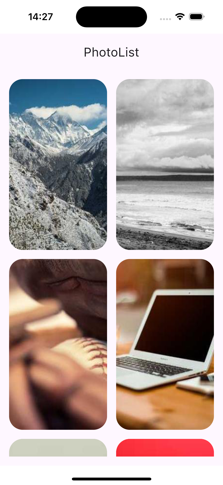

# Kotlin Multiplatform Image Viewer

This project is a Kotlin Multiplatform (KMP) mobile application for iOS and Android that retrieves and displays a random list of images. The main goal of the project is to demonstrate the ability to integrate and use the third-party library **SDWebImage** in an iOS application.

## 📌 Key Technologies

- **Kotlin Multiplatform (KMP)** — Shared code for Android and iOS.
- **Ktor HTTP Client** — Used to fetch the list of images from the server.
- **Koin** — Dependency injection framework.
- **Coil (Android)** — Image loading library.
- **SDWebImage (iOS, via CocoaPods)** — Third-party library for loading and displaying images in iOS applications.

## 📱 Screenshots

### Android phone
 

### iOS phone
 

### Android tablet
 

### iOS tablet
 

## 🔧 Installation & Setup

### Running the Application
The project is launched via **Android Studio**.

```sh
# Open the project in Android Studio and run the desired platform
```

## 📦 Project Structure
```
root
│── composeApp/      # Shared code (Kotlin Multiplatform)
│   ├── commonMain/  # Shared module (all business logic)
│   ├── androidMain/ # Android application (only classes that call platform-specific code, e.g., Context)
│   ├── iosMain/     # iOS application
│── server/          # Server component
```
All business logic is located in the **shared** module and implemented using the **expected - actual** mechanism, allowing platform-specific code to utilize Android and iOS dependencies.
